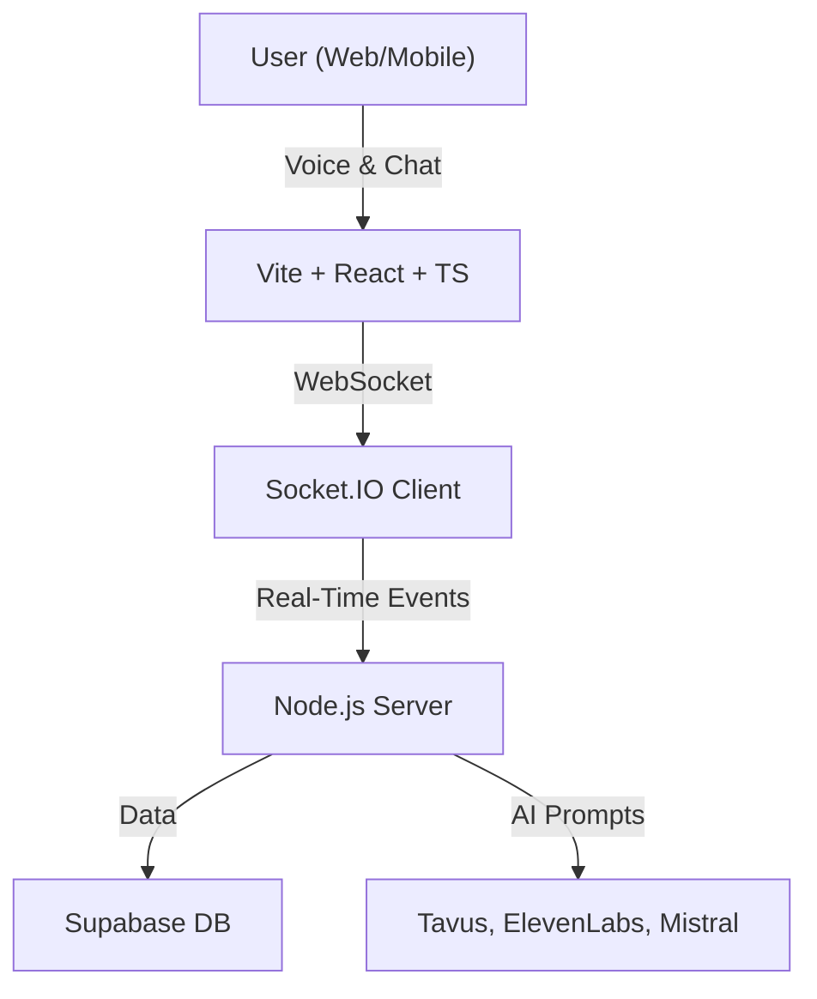

# EchoRoom 🚀

   

> **EchoRoom** is a next-generation, mood-based voice and chat platform for meaningful, emotionally resonant group conversations. Designed for the world's largest hackathon by Bolt, EchoRoom blends real-time voice, AI-powered chat, and a safe, anonymous environment to foster mental wellness and authentic connection.

---

## 📚 Table of Contents
1. [Why EchoRoom?](#-why-echoroom)
2. [Features](#-features)
3. [Architecture](#-architecture)
4. [Project Structure](#-project-structure)
5. [Getting Started](#-getting-started)
6. [Usage](#-usage)
7. [AI & Real-Time Technology](#-ai--real-time-technology)
8. [Accessibility & Mobile Experience](#-accessibility--mobile-experience)
9. [Key Technologies](#-key-technologies)
10. [What's Next](#-whats-next)
11. [Contributing](#-contributing)
12. [License](#-license)
13. [Acknowledgements](#-acknowledgements)
14. [Contact](#-contact)

---

## 🌟 Why EchoRoom?
- **Emotional Connection:** Join mood-based rooms for authentic, supportive conversations.
- **AI-Enhanced:** Interact with AI avatars and voice agents for a unique group experience.
- **Seamless Voice + Chat:** Real-time voice and text, with smooth transitions.
- **Safe & Anonymous:** No personal data required—just your mood and your voice.
- **Modern Responsive UI:** Works great on desktop and mobile browsers.

---

## 🛠️ Features (Codebase-Verified)
- **Mood-Based Rooms:** Join rooms based on your selected mood for tailored group conversations.
- **Real-Time Voice & Video:**
  - Voice controls: mute/unmute, speaking status, and participant list.
  - WebRTC video call support for AI avatars and users.
- **Real-Time Chat:**
  - Send and receive messages instantly.
  - Typing indicators show who is typing.
  - Emoji reactions to messages.
- **AI Avatar Integration:**
  - Interactive AI avatar card (TavusAvatarCard) with video, voice, and preview modes.
  - ElevenLabs ConvoAI widget for voice-based AI chat (mobile and desktop variants).
  - Mistral LLM integration for chat/mood analysis and moderation 
- **Anonymous User Identity:**
  - Anonymous user ID and username generation, persisted in localStorage.
  - UserNameModal for setting/changing display name.
- **Participant Management:**
  - Real-time participant join/leave, voice status, and mood display.
  - Backend API integration for participant creation and updates.
- **Session Management:**
  - Join/leave room logic, session state, and participant state management via context providers.
- **Sound & Notification Controls:**
  - Sound toggle, beep/zoom sounds, and volume/mute controls.
- **Modern UI/UX:**
  - Floating particles background, modern UI components (button, badge, card, etc.).
  - Responsive design for mobile and desktop.
  - Framer Motion animations for smooth transitions.
- **Accessibility:**
  - Keyboard navigation and ARIA support in UI components.
- **Persistent State:**
  - Chat and user state persisted in localStorage for session continuity.

---

## 🏗️ Architecture



**Key Components:**
- **Frontend:** Modern React app with TypeScript, Tailwind CSS, and Framer Motion for smooth UI/UX.
- **WebSocket Layer:** Socket.IO for real-time, bi-directional communication (voice, chat, reactions, typing).
- **Backend:** Node.js server orchestrates rooms, chat, voice, and AI events. ([Backend Repo](https://github.com/OsbornNyakaru/backend-echo))
- **Database:** Supabase for persistent chat history, analytics, and user/session data.
- **AI Service:** Integrated with Tavus (AI video avatars), ElevenLabs (voice-based AI chat), and Mistral (LLM for chat and mood analysis).

---

## 📂 Project Structure

```text
src/
├── components/    # UI, chat, voice, dashboard
│   ├── chat/      # Real-time chat components
│   ├── voice/     # Voice-related components
│   ├── ui/        # Base UI elements
│   └── ...
├── pages/         # Home, Welcome, Room, Dashboard
├── hooks/         # useSocket, useChat, useVoice, useRoom
├── context/       # Socket, Chat, Room providers
├── lib/           # socket, chatUtils, voiceUtils
├── types/         # chat, room, socket types
├── styles/        # Global CSS
```

**Notable Files:**
- `src/components/chat/ChatWindow.tsx`: Main chat interface
- `src/components/voice/VoiceControls.tsx`: Voice controls
- `src/context/SocketContext.tsx`: WebSocket provider
- `src/hooks/useChat.ts`: Chat logic
- `src/lib/socket.ts`: Socket.IO configuration
- `src/types/`: TypeScript types for safety

---

## 🚀 Getting Started

1. **Clone the frontend repo:**
   ```bash
   git clone https://github.com/OsbornNyakaru/EchoRoom.git
   cd EchoRoom
   ```
2. **Install dependencies:**
   ```bash
   npm install
   ```
3. **Start the dev server:**
   ```bash
   npm run dev
   ```
4. **Build for production:**
   ```bash
   npm run build
   ```
5. **Preview production build:**
   ```bash
   npm run preview
   ```

> **Note:** The backend server is required for full functionality. See the [EchoRoom Backend Repo](https://github.com/OsbornNyakaru/backend-echo) for setup instructions.

---

## 💬 Usage
- **Join a Room:** Select your mood and enter a voice+chat room.
- **Chat & React:** Send messages, react with emojis, and see who's typing.
- **Voice Participation:** Speak, mute/unmute, and see who's talking in real time.
- **AI Avatars:** Interact with AI avatars (Tavus, ElevenLabs) in supported rooms.

---

## 🖼️ Screenshots

> _Screenshots of the main features below to showcase the UI and experience._

| Home Page | Welcome Page | Room (Voice + Chat) | AI Avatar | Mobile View |
|-----------|--------------|---------------------|-----------|-------------|
|  |  |  |   |  |

| AI Avatar Dashboard | ElevenLabs Voice Agent |
|---------------------|-----------------------|
|  |  |

---

## 🤖 AI & Real-Time Technology

### AI Features
- **Tavus:** Integrated as an interactive AI video avatar. Users can interact with the TavusAvatarCard, which supports video, voice, and preview modes. The avatar is fetched dynamically and can be used for both video calls and voice-only sessions. The card provides a seamless UI for switching between modes and is available on both mobile and desktop layouts.
- **ElevenLabs:** Integrated as a real-time voice AI agent. The ElevenLabsConvoAIWidget is embedded directly into the UI, dynamically loading the ElevenLabs ConvoAI widget script. It adapts its appearance for mobile (expandable orb) and desktop (full widget), allowing users to have live voice conversations with the AI agent in supported rooms.
- **Mistral:** LLM integration for chat/mood analysis and moderation.

### Real-Time Features
- **Live Participant Updates:** See who joins/leaves, who's speaking, and who's typing in real time.
- **Message Reactions:** Emoji reactions update instantly for all users.
- **Typing Indicators:** Animated, real-time typing status.
- **Voice Status:** See who is muted, speaking, or idle.
- **Connection Resilience:** Automatic reconnection and message queuing for reliability.

---

## ♿ Accessibility & Mobile Experience
- **Keyboard Navigation:** Full support for keyboard shortcuts and navigation.
- **Screen Reader Support:** ARIA labels and accessible UI elements.
- **Mobile Optimization:** Responsive design for mobile browsers.

---

## 🤖 Key Technologies
- **Frontend:** Vite, React 18, TypeScript, Tailwind CSS, Framer Motion
- **Backend:** Node.js, Supabase, Socket.IO ([Backend Repo](https://github.com/OsbornNyakaru/backend-echo))
- **AI:** Tavus, ElevenLabs, Mistral

---

## 🚧 What's Next
These features are planned or in progress, but not yet implemented:
- **Swipe Gestures:** For switching between chat and voice on mobile.
- **Floating Chat Button:** Quick access to unread messages on mobile.
- **Voice-to-Text:** Convert voice to chat messages for inclusivity.
- **Message Search & Highlights:** Search chat history and highlight key moments.
- **Advanced AI Moderation:** Off-topic detection, session transitions, and time warnings.
- **Mood Monitoring & Encouragement:** AI-driven mood checks and positive reinforcement.

---

## 🧩 Contributing
We welcome contributions! Please fork the repo, create a feature branch, and submit a pull request. For major changes, open an issue first to discuss your ideas.

---

## 📄 License
MIT License. See [LICENSE](LICENSE) for details.

---

## 🙌 Acknowledgements
- Built for the World's Largest Hackathon by Bolt.new 2025
- Inspired by the need for safe, meaningful online connection
- Thanks to all open-source contributors and the mental wellness community

---

## 📣 Contact
For questions, feedback, or partnership, reach out via [GitHub Issues](https://github.com/OsbornNyakaru/EchoRoom/issues). 